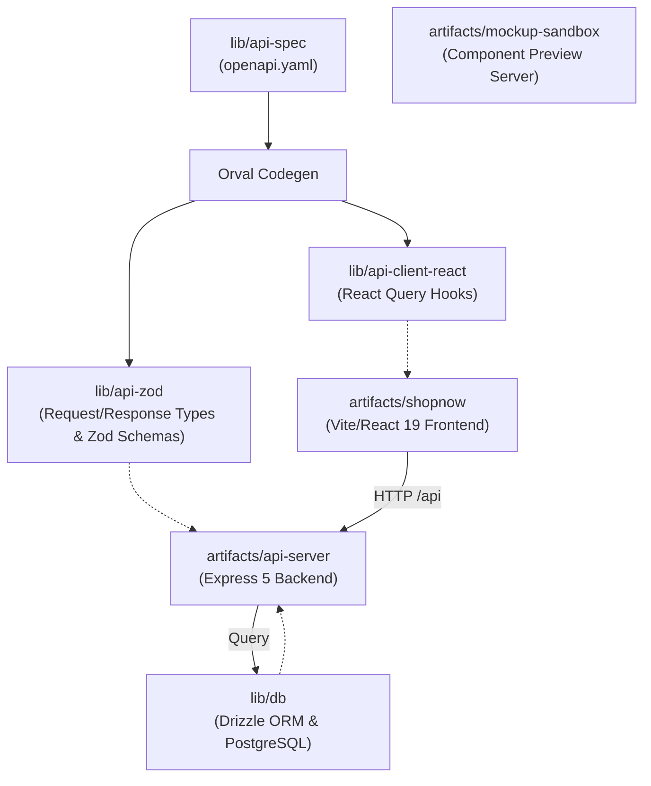

# ECommerce Design Suite: Architecture Analysis

This document provides a detailed breakdown of the project architecture, directory structure, data flow, database schemas, API routes, and runtime operations of the ECommerce Design Suite.

---

## 1. High-Level Architecture Overview

The codebase is organized as a **TypeScript-based monorepo** managed with **pnpm workspaces**. It is divided into two primary directories:

*   **`lib/`**: Shared core logic, OpenAPI specifications, auto-generated API clients and Zod schemas, database connection pooling, and Drizzle ORM schemas.
*   **`artifacts/`**: Deployable services and applications including the Express 5 API server, the main frontend client (ShopNow), and a dedicated visual design mockup sandbox.

The project relies on **Contract-First API Development** and **Automated Code Generation** to maintain 100% type safety and payload contract consistency between backend services and frontend applications.



---

## 2. Directory Structure & Repository Map

Here is where the key components of the application reside:

### Shared Libraries (`lib/`)

*   **[`lib/api-spec`](file:///c:/My%20Projects/ECommerce-Design-Suite/ECommerce-Design-Suite/lib/api-spec)**: Contains the single source-of-truth OpenAPI specification ([`openapi.yaml`](file:///c:/My%20Projects/ECommerce-Design-Suite/ECommerce-Design-Suite/lib/api-spec/openapi.yaml)) and Orval configuration ([`orval.config.ts`](file:///c:/My%20Projects/ECommerce-Design-Suite/ECommerce-Design-Suite/lib/api-spec/orval.config.ts)).
*   **[`lib/api-zod`](file:///c:/My%20Projects/ECommerce-Design-Suite/ECommerce-Design-Suite/lib/api-zod)**: Contains payload Zod schemas and TypeScript types generated by Orval. Used by the API server to validate incoming HTTP request payloads.
*   **[`lib/api-client-react`](file:///c:/My%20Projects/ECommerce-Design-Suite/ECommerce-Design-Suite/lib/api-client-react)**: TanStack React Query hooks generated by Orval. Used by frontends for type-safe server queries and mutations.
*   **[`lib/db`](file:///c:/My%20Projects/ECommerce-Design-Suite/ECommerce-Design-Suite/lib/db)**: The database layer. Configures PostgreSQL connection pooling ([`src/index.ts`](file:///c:/My%20Projects/ECommerce-Design-Suite/ECommerce-Design-Suite/lib/db/src/index.ts)) and defines Drizzle schemas ([`src/schema/`](file:///c:/My%20Projects/ECommerce-Design-Suite/ECommerce-Design-Suite/lib/db/src/schema/)).

### Applications & Services (`artifacts/`)

*   **[`artifacts/api-server`](file:///c:/My%20Projects/ECommerce-Design-Suite/ECommerce-Design-Suite/artifacts/api-server)**: The backend web server built using Express 5.
    *   **[`src/routes/`](file:///c:/My%20Projects/ECommerce-Design-Suite/ECommerce-Design-Suite/artifacts/api-server/src/routes/)**: Implements RESTful API endpoints for:
        *   `auth.ts` — User registration, login, logout, profile session (`/api/auth/*`)
        *   `products.ts` — Product list, deals, search, categories, product details (`/api/products/*`)
        *   `cart.ts` — Shopping cart query, add/update/remove/clear line items (`/api/cart/*`)
        *   `checkout.ts` — Checkout processing and order creation (`/api/checkout`)
        *   `orders.ts` — User order history & order details (`/api/orders/*`)
        *   `reviews.ts` — Product ratings & customer review submission (`/api/reviews/*`)
        *   `recommendations.ts` — AI/Rule recommendation engines for Homepage, PDP, and Cart (`/api/recommendations/*`)
        *   `ai.ts` — E-Commerce assistant AI chatbot endpoint (`/api/ai/chat`)
        *   `health.ts` — Health check endpoint (`/api/healthz`)
*   **[`artifacts/shopnow`](file:///c:/My%20Projects/ECommerce-Design-Suite/ECommerce-Design-Suite/artifacts/shopnow)**: "ShopNow Electronics" — the main consumer-facing web application built on Vite, React 19, Tailwind CSS (v4), Radix UI primitives, Lucide icons, and Framer Motion.
    *   Features: Home, Search, Category views, PDP with gallery & customer reviews, Cart, Checkout, Order History, Auth Pages (Login/Signup), Anonymous & Logged-in Recommendation Carousels, and an AI Chatbot widget (`AIChatbot.tsx`).
*   **[`artifacts/mockup-sandbox`](file:///c:/My%20Projects/ECommerce-Design-Suite/ECommerce-Design-Suite/artifacts/mockup-sandbox)**: An interactive development canvas environment allowing visual designers to preview UI components in isolation.
    *   **[`mockupPreviewPlugin.ts`](file:///c:/My%20Projects/ECommerce-Design-Suite/ECommerce-Design-Suite/artifacts/mockup-sandbox/mockupPreviewPlugin.ts)**: Custom Vite plugin scanning `src/components/mockups/` on-the-fly and generating dynamic import manifests.

---

## 3. The Codegen Pipeline

The contract synchronization workflow prevents API drift:

```
[openapi.yaml] --(orval)---> [@workspace/api-zod] ---------> (Express Payload Validators)
                      |
                      +------> [@workspace/api-client-react] --> (React Query Client Hooks)
```

1.  **Contract Definition**: Endpoints, query parameters, request schemas, and response schemas are specified in [`openapi.yaml`](file:///c:/My%20Projects/ECommerce-Design-Suite/ECommerce-Design-Suite/lib/api-spec/openapi.yaml).
2.  **Code Generation**: Running `pnpm --filter @workspace/api-spec run codegen` invokes Orval to produce:
    *   Zod validation rules inside `lib/api-zod`.
    *   React Query hooks inside `lib/api-client-react` with custom fetch logic (`custom-fetch.ts`).
3.  **Strict Enforcement**:
    *   **Backend**: Server endpoints validate request bodies using generated Zod schemas (e.g. `AddToCartBody.safeParse(req.body)`).
    *   **Frontend**: React components call type-safe query/mutation hooks (e.g. `useGetProducts`, `useAddToCart`, `useLogin`).

---

## 4. Database Schema Design

Data persistence is managed via **Drizzle ORM** with PostgreSQL. Schemas reside in [`lib/db/src/schema/`](file:///c:/My%20Projects/ECommerce-Design-Suite/ECommerce-Design-Suite/lib/db/src/schema/):

### 1. Users Table (`users`)
Stores user accounts and authentication details.
*   `id`: Primary key (serial)
*   `name`: Display name (text)
*   `email`: Unique email address (text)
*   `passwordHash`, `salt`: Salted password hash strings (text)
*   `createdAt`: Registration timestamp

### 2. Products Table (`products`)
Stores the catalog of products with pricing, stock, and promotional flags.
*   `id`: Primary key (serial)
*   `name`, `brand`: Product name and manufacturer
*   `price`, `originalPrice`: Decimal pricing values
*   `discountPct`: Percentage discount calculation
*   `category`: Product category tag
*   `imageUrl`: Asset image link
*   `rating`, `reviewCount`: Cached aggregate rating metrics
*   `inStock`, `stockCount`: Inventory counters
*   `specs`: JSON/string product specifications
*   `isFeatured`, `isDeal`: Operational flags for homepage promotions

### 3. Cart Items Table (`cart_items`)
Stores session-based shopping cart items.
*   `id`: Primary key (serial)
*   `sessionId`: Session/User identifier mapping
*   `productId`: Foreign key to `products.id`
*   `quantity`: Line item quantity
*   `createdAt`: Timestamp

### 4. Orders & Order Items (`orders`, `order_items`)
Stores customer orders and historical line items.
*   `orders`: `id`, `userId` (FK to `users.id`), `totalAmount`, `status`, `shippingAddress` (JSONB), `paymentDetails` (JSONB), `createdAt`
*   `order_items`: `id`, `orderId` (FK to `orders.id`), `productId` (FK to `products.id`), `quantity`, `priceAtPurchase`

### 5. Product Reviews Table (`reviews`)
Stores verified customer reviews with rating constraints.
*   `id`: Primary key (serial)
*   `productId`: Foreign key to `products.id`
*   `userId`: Foreign key to `users.id`
*   `userName`: Author display name
*   `rating`: Rating score (1-5 integer)
*   `title`, `comment`: Review content
*   `createdAt`: Timestamp
*   Unique index on `(user_id, product_id)` ensures one review per user per product.

---

## 5. Mockup Sandbox Architecture

The mockup sandbox is a developer preview utility:

*   **Dynamic Directory Scanning**: [`mockupPreviewPlugin.ts`](file:///c:/My%20Projects/ECommerce-Design-Suite/ECommerce-Design-Suite/artifacts/mockup-sandbox/mockupPreviewPlugin.ts) watches `src/components/mockups/`.
*   **Manifest Generation**: Generates `src/.generated/mockup-components.ts` mapping path slugs to dynamic imports.
*   **Isolated Component Rendering**: Displays design mockups in clean isolation for rapid UI design iterations.

---

## 6. How to Run and Build the Workspace

Always use **`pnpm`** as the monorepo package manager.

### Common Commands

| Command | Location | Description |
| :--- | :--- | :--- |
| `pnpm install` | Root | Installs dependencies across all workspace packages |
| `pnpm run build` | Root | Compiles and builds all packages (including TypeScript checks) |
| `pnpm run typecheck` | Root | Executes TypeScript type checking across entire monorepo |
| `pnpm --filter @workspace/api-spec run codegen` | Root | Regenerates React Query hooks and Zod schemas from `openapi.yaml` |
| `pnpm --filter @workspace/db run push` | Root | Pushes Drizzle DB schema updates to PostgreSQL |
| `pnpm --filter @workspace/api-server run dev` | Root | Launches backend Express API server on Port 5000 |
| `pnpm --filter @workspace/shopnow run dev` | Root | Launches ShopNow frontend Vite dev server |
| `pnpm --filter @workspace/mockup-sandbox run dev` | Root | Launches mockup preview sandbox Vite dev server |

---

## 7. Key Tech Stack Summary

*   **Package Manager**: `pnpm` workspaces
*   **Language**: TypeScript `5.9`, Node.js `24`
*   **Backend**: Express `5`, Pino Logger
*   **Database & ORM**: PostgreSQL, Drizzle ORM, `drizzle-zod`
*   **Input Validation**: Zod (`v4`)
*   **Code Generation**: Orval (OpenAPI to React-Query + Zod)
*   **Frontend Apps**: React `19`, Vite, TanStack React Query `v5`, Wouter routing, Tailwind CSS `v4`, Radix UI, Lucide React, Framer Motion
