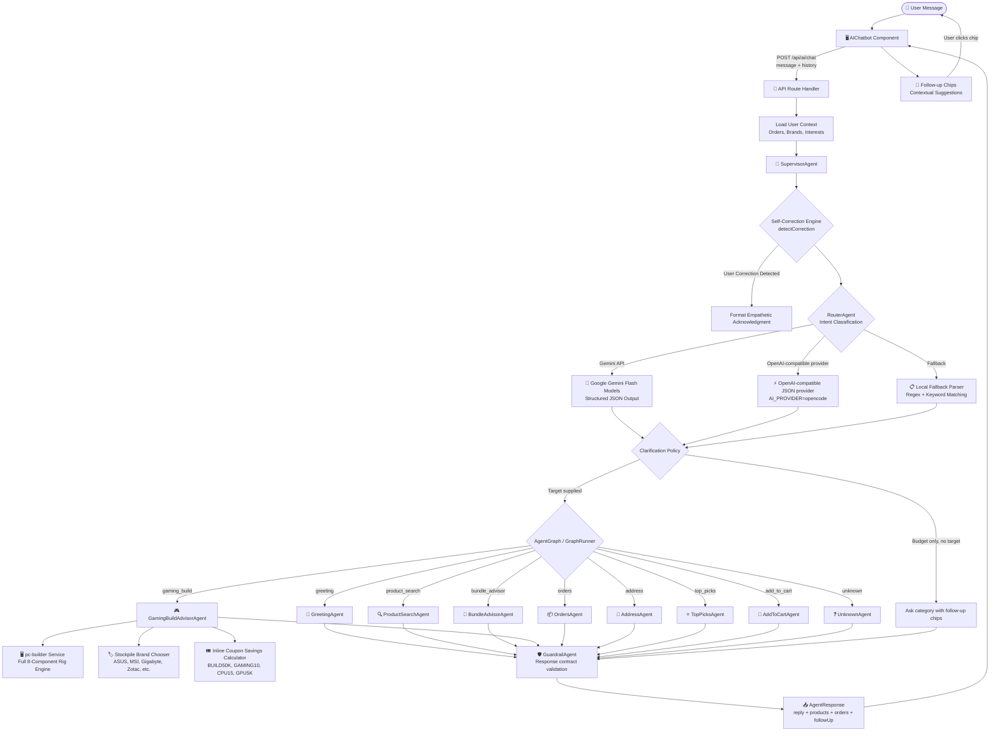
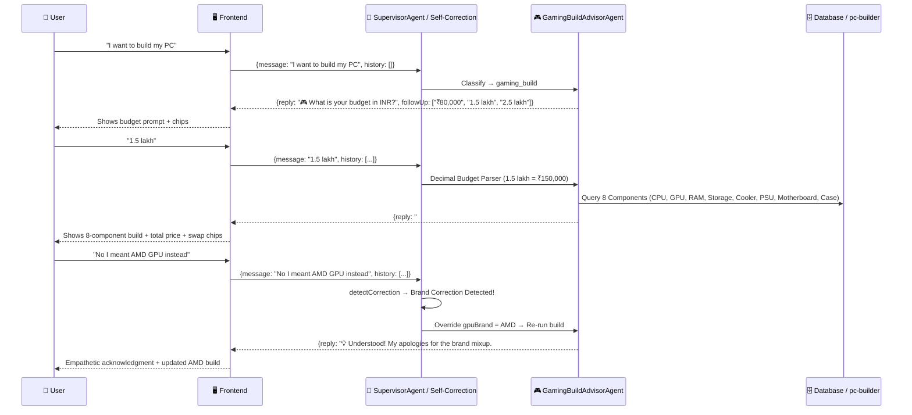

# 🤖 Agentic AI Architecture — ShopNow E-Commerce

## Overview

ShopNow implements a **supervisor-driven, graph-style multi-agent conversational AI** system that provides personalized, multi-turn shopping assistance. The system features an **Adaptive Self-Correction & Error Recovery Engine**, a pluggable model-provider layer for intent classification, a supervisor for orchestration and fault-tolerant fallbacks, and a deterministic PC Builder engine supporting complete 8-component gaming rigs.

---

## System Flow



---

## Multi-Turn Conversation & Self-Correction Flow



---

## Agent Architecture

### Directory Structure

```
artifacts/api-server/src/agents/
├── index.ts                    # Barrel exports
├── types.ts                    # Shared interfaces
├── supervisor-agent.ts         # 🧠 Orchestrates agent workflow + fault-tolerant recovery
├── self-correction-engine.ts   # 💡 Detects user corrections & generates empathetic self-correcting prefixes
├── router-agent.ts             # Intent classification + active conversation persistence
├── clarification-policy.ts     # Stops vague budget-only catalog searches
├── gaming-build-advisor-agent.ts # 🎮 8-Component PC Build advisor, brand chooser & inline coupon calculator
├── agent-graph.ts              # Specialist nodes and intent edges
├── graph-runner.ts             # Executes the selected graph path
├── guardrail-agent.ts          # Validates final frontend response contract
├── user-context.ts             # Loads user profile from DB
├── greeting-agent.ts           # 👋 Welcome + personalization
├── product-search-agent.ts     # 🔍 Cascading product search with keyword intelligence
├── bundle-advisor-agent.ts     # 🎁 Profession-based bundle recommendations
├── top-picks-agent.ts          # ⭐ History-based recommendations
├── orders-agent.ts             # 📦 Order history (login-gated)
├── address-agent.ts            # 📍 Shipping address (login-gated)
├── add-to-cart-agent.ts        # 🛒 Single + bulk add via conversation
└── unknown-agent.ts            # ❓ Fallback + suggestions
```

---

## Core Interfaces

```typescript
interface AgentContext {
  message: string;
  userId: number | null;
  userContext: UserContext;
  history?: Array<{ role: string; content: string }>;
}

interface AgentResponse {
  reply: string;           // Natural language response
  products: any[];         // Product cards to display
  orders: any[];           // Order cards to display
  requiresLogin?: boolean; // Show login button
  followUp?: string[];     // Suggestion chips for next turn
  userContext: { ... };    // User metadata
}

interface CorrectionAnalysis {
  isCorrection: boolean;
  correctionType?: 'budget' | 'brand' | 'category' | 'component' | 'intent' | 'general';
  correctedValue?: string | number;
  explanation?: string;
}
```

---

## Key Agent Capabilities

### 💡 Self-Correction & Error Recovery Engine (`self-correction-engine.ts`)

- **User Correction Detection**: Scans user input for correction patterns (`"no I meant"`, `"that's not what I asked"`, `"I already said"`, `"you misunderstood"`, `"wrong brand"`).
- **Empathy & Learning**: Generates natural, apologetic acknowledgment prefixes (`"💡 Understood! My apologies for the brand mixup. I've updated the brand filter for you:"`).
- **Fault Tolerance**: Wraps graph execution in `try-catch` blocks. If downstream API calls or LLM services fail, `SupervisorAgent` triggers a self-healing fallback response instead of breaking the chat.

### 🎮 GamingBuildAdvisorAgent & Deterministic PC Builder (`pc-builder.ts`)

- **Full 8-Component Rigs**: Recommends complete, compatible hardware configurations across **Processor**, **CPU Cooler**, **Graphics Card**, **RAM**, **Storage**, **Power Supply**, **Motherboard** (404 items in catalog), and **Case / Cabinet** (629 items in catalog).
- **Decimal & Multi-Format Budget Parser**: Converts inputs like `1.5 lakh`, `1.5L`, `150k`, `₹1,50,000`, `1.5` to ₹150,000.
- **Stockpile Brand Chooser**:
  - Dynamically queries live in-stock brands for any component type (`ASUS`, `MSI`, `Gigabyte`, `Zotac`, `ASRock`, `Galax`, `Inno3D`, `Corsair`, `Fractal Design`, `Lian Li`, `NZXT`).
  - Handles requests for unstocked or future hardware (e.g. `"I want to add the NVIDIA 5090 card"`) by informing the user of catalog availability and presenting a 1-tap brand discovery menu.
- **Inline Coupon Calculator**:
  - Calculates exact promo code savings directly inside the PC build flow without losing context.
  - Highlights `BUILD50K` (flat ₹5,000 off), `GAMING10` (10% off), `CPU15` (15% off CPU), `GPU5K` (flat ₹5,000 off GPU).

---

## Security & Safety

- **Login gates**: Orders, Address, AddToCart require authentication
- **Session isolation**: Cart uses `user_{id}` or `default` session IDs
- **Input validation**: Message required, history capped at 8 entries
- **Provider fallback**: Works seamlessly without an API key using the local regex/keyword parser
- **No PII in logs**: Only intent name + agent name logged
- **Non-electronics guardrail**: Gracefully blocks out-of-domain requests
