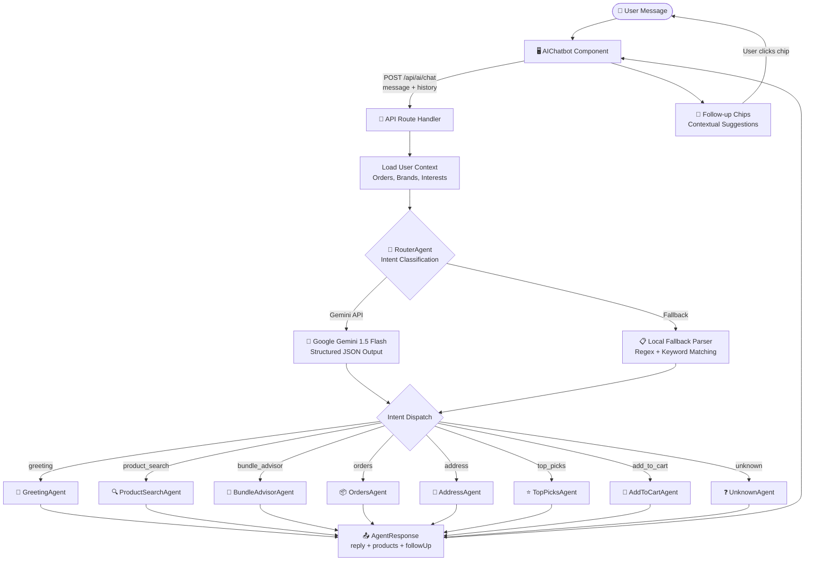
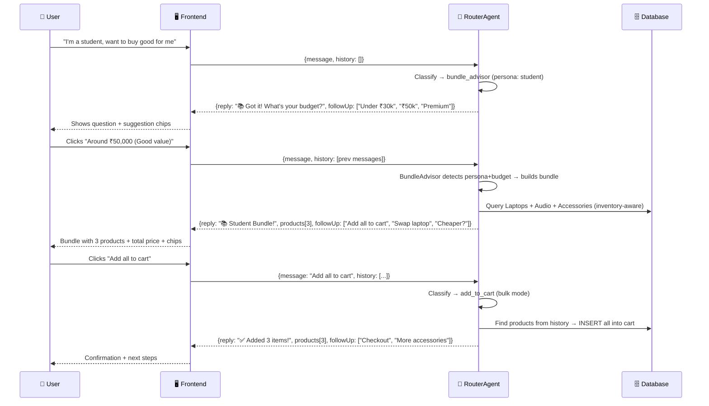
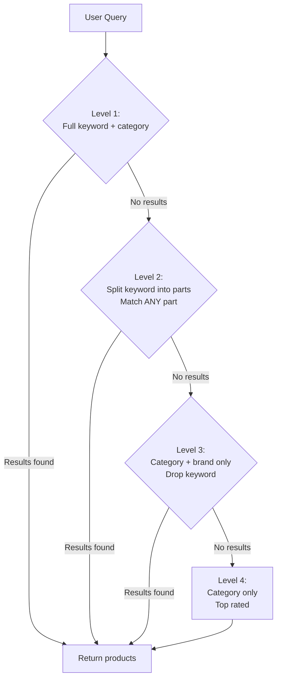
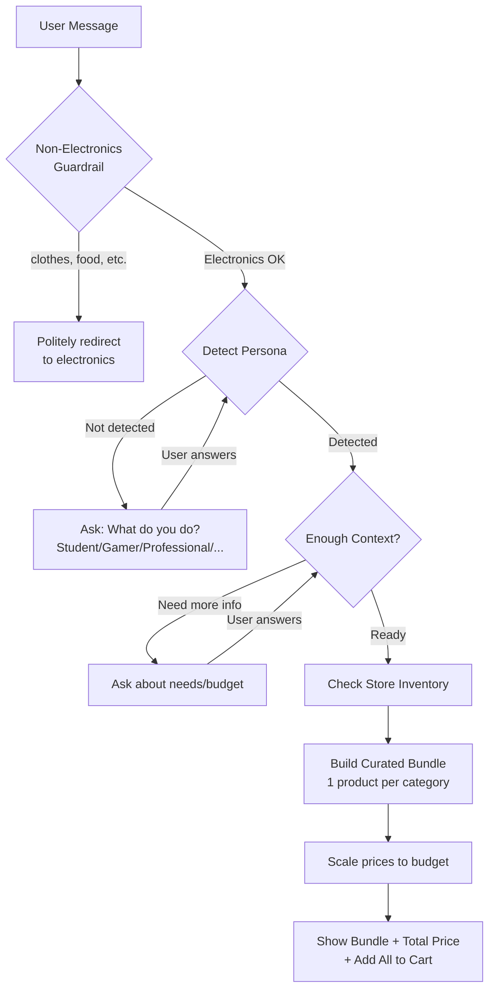
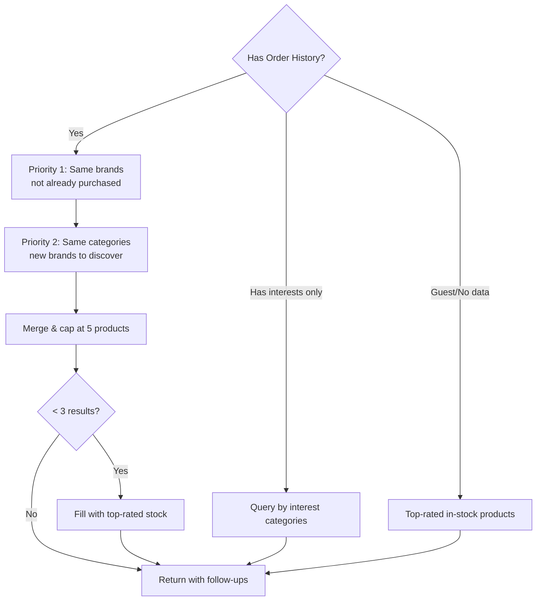
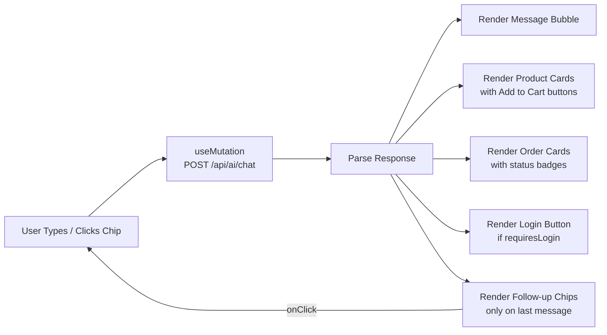
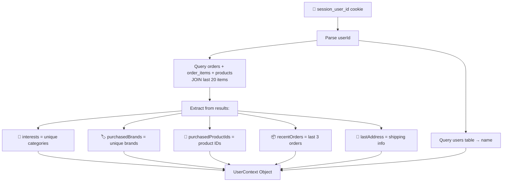

**# 🤖 Agentic AI Architecture — ShopNow E-Commerce

## Overview

ShopNow implements a **multi-agent conversational AI** system that provides personalized, multi-turn shopping assistance. The system uses Google Gemini for intent classification and a router-based agent dispatch pattern to handle diverse shopping intents — including intelligent profession-based bundle recommendations, inventory-aware product search, and non-electronics guardrails.

---

## System Flow



---

## Multi-Turn Conversation Flow



---

## Agent Architecture

### Directory Structure

```
artifacts/api-server/src/agents/
├── index.ts                    # Barrel exports
├── types.ts                    # Shared interfaces
├── router-agent.ts             # 🧠 Brain — intent classification + dispatch
├── user-context.ts             # Loads user profile from DB
├── greeting-agent.ts           # 👋 Welcome + personalization
├── product-search-agent.ts     # 🔍 Cascading product search with keyword intelligence
├── bundle-advisor-agent.ts     # 🎁 Profession-based bundle recommendations
├── top-picks-agent.ts          # ⭐ History-based recommendations
├── orders-agent.ts             # 📦 Order history (login-gated)
├── address-agent.ts            # 📍 Shipping address (login-gated)
├── add-to-cart-agent.ts        # 🛒 Single + bulk add via conversation
└── unknown-agent.ts            # ❓ Fallback + suggestions
```

---

## Core Interfaces

```typescript
interface AgentContext {
  message: string;
  userId: number | null;
  userContext: UserContext;
  history?: Array<{ role: string; content: string }>;
}

interface AgentResponse {
  reply: string;           // Natural language response
  products: any[];         // Product cards to display
  orders: any[];           // Order cards to display
  requiresLogin?: boolean; // Show login button
  followUp?: string[];     // Suggestion chips for next turn
  userContext: { ... };    // User metadata
}

interface UserContext {
  name?: string;
  recentOrders?: Array<{ id, totalAmount, status, products[] }>;
  lastAddress?: any;
  interests?: string[];           // Categories from order history
  purchasedProductIds?: number[]; // Already bought (exclude from recs)
  purchasedBrands?: string[];     // Preferred brands
}
```

---

## Agent Details

### 🧠 RouterAgent (Brain)

| Feature                | Implementation                                                                                             |
| ---------------------- | ---------------------------------------------------------------------------------------------------------- |
| **Primary**            | Google Gemini 1.5 Flash with structured JSON schema                                                        |
| **Fallback**           | Local regex/keyword parser (no API key needed)                                                             |
| **Context**            | Passes conversation history for multi-turn awareness                                                       |
| **Intents**            | `greeting`, `product_search`, `bundle_advisor`, `orders`, `address`, `top_picks`, `add_to_cart`, `unknown` |
| **Keyword Extraction** | Explicit model name extraction (e.g. "Galaxy S22" → keyword)                                               |
| **Guardrails**         | Non-electronics requests redirected with helpful message                                                   |

### 🔍 ProductSearchAgent (Cascading Search)



- **Cascading strategy**: Specific → progressively broader (never returns empty)
- Builds Drizzle ORM queries with category/price/brand/keyword filters
- Only shows in-stock products (limit 6)
- **Generates smart follow-ups** based on results, budget, brands, category

### 🎁 BundleAdvisorAgent (Profession-Based Bundles)



**Supported Professions (10):**

| Persona      | Emoji | Bundle Categories                                    |
| ------------ | ----- | ---------------------------------------------------- |
| Student      | 📚    | Laptop + Headphones + Accessories                    |
| Gamer        | 🎮    | Gaming Laptop + Headset + Peripherals                |
| Professional | 💼    | Work Laptop + NC Headphones + Ergonomics             |
| Creator      | 🎬    | Camera + Audio + Editing Laptop                      |
| Doctor       | 🩺    | Portable Laptop + Phone + Headphones                 |
| Teacher      | 👩‍🏫    | Laptop + Webcam/Accessories + Headset                |
| Architect    | 🏗️    | Powerful Laptop + Precision Mouse + Focus Headphones |
| Musician     | 🎵    | Studio Headphones + Production Laptop + Audio Gear   |
| Photographer | 📸    | Camera + Editing Laptop + Accessories                |
| Freelancer   | 🏠    | Versatile Laptop + NC Headphones + Office Essentials |

**Key Intelligence Features:**

- ✅ **Inventory-aware** — checks actual stock before recommending
- ✅ **Budget scaling** — scales all item prices proportionally to budget
- ✅ **Guardrails** — rejects non-electronics (clothes, food, furniture, etc.)
- ✅ **Multi-turn** — asks follow-up questions before building bundle
- ✅ **Suggests alternatives** when items are out of stock

### 🛒 AddToCartAgent (Single + Bulk)

| Mode       | Trigger                              | Behaviour                                                      |
| ---------- | ------------------------------------ | -------------------------------------------------------------- |
| **Single** | "add to cart"                        | Adds top product from conversation context                     |
| **Bulk**   | "add all to cart" / "add everything" | Parses product names from recent AI messages, adds ALL to cart |

- Reads `**Product Name**` patterns from assistant messages in history
- Checks for duplicates (already in cart)
- Returns total for all added items + checkout follow-up

### ⭐ TopPicksAgent (Recommendation Engine)



### 🔐 Login-Gated Agents (Orders, Address, AddToCart)

- Check `userId` before executing
- Return `requiresLogin: true` + friendly prompt
- Frontend renders an inline "Log In →" button

---

## Guardrails & Safety

### Non-Electronics Guardrail

The system detects requests for non-electronics categories and politely redirects:

```
❌ "I want to buy shoes"
→ "I'm specialized in electronics & tech — laptops, phones, headphones, cameras, and accessories!
   I can't help with "shoes" unfortunately. But I can help you find the perfect tech setup!"
```

**Blocked categories:** Clothing, food/grocery, furniture, cosmetics, books/stationery, toys, kitchenware, sports equipment, medicine, jewellery, vehicles.

### Intent Misclassification Prevention

| User Says                     | Correct Intent                         | Wrong Intent (prevented) |
| ----------------------------- | -------------------------------------- | ------------------------ |
| "I want to buy Galaxy S22"    | `product_search` (keyword: Galaxy S22) | ~~add_to_cart~~          |
| "I'm a student, need a setup" | `bundle_advisor`                       | ~~product_search~~       |
| "Add all to cart"             | `add_to_cart` (bulk)                   | ~~unknown~~              |
| "Show me shoes"               | Guardrail redirect                     | ~~product_search~~       |

---

## Frontend Integration

### AIChatbot Component



**Key Features:**

- Sends last 8 messages as `history[]` for context
- Follow-up chips only render on the **most recent** AI message
- Product cards have inline "Add to Cart" buttons
- Order cards link to `/orders` page
- Login buttons link to `/login` page
- Bundle responses show total price + "Add all to cart" chip

---

## Data Flow: User Context Loading



---

## Example Conversations

### 📚 "I'm a student, want to buy good for me" (Bundle Flow)

| Turn | User                                     | Agent         | Response                                                                                                        |
| ---- | ---------------------------------------- | ------------- | --------------------------------------------------------------------------------------------------------------- |
| 1    | "I am a student want to buy good for me" | BundleAdvisor | "📚 Got it! I'll build a student bundle. What's your budget?" + chips: `Under ₹30k` `₹50k` `₹80k` `No limit`    |
| 2    | "Around ₹50,000"                         | BundleAdvisor | Shows 3-item bundle (Laptop ₹35k + Headphones ₹4k + Mouse ₹2k) = ₹41k ✅ within budget + "Add all to cart" chip |
| 3    | "Add all to cart"                        | AddToCart     | ✅ Added 3 items to cart! Total: ₹41,000 + chips: `Checkout` `More accessories`                                 |

### 🎮 "I need a gaming setup" (Bundle Flow)

| Turn | User                          | Agent         | Response                                                     |
| ---- | ----------------------------- | ------------- | ------------------------------------------------------------ |
| 1    | "I need a gaming setup"       | BundleAdvisor | "🎮 Got it! I'll build a gaming bundle. What's your budget?" |
| 2    | "₹1 lakh"                     | BundleAdvisor | Shows Gaming Laptop + Gaming Headset + Gaming Mouse bundle   |
| 3    | "Swap the laptop for cheaper" | BundleAdvisor | Shows updated bundle with budget laptop                      |

### 🔍 "I want Galaxy S22" (Specific Product Search)

| Turn | User                       | Agent         | Response                                                             |
| ---- | -------------------------- | ------------- | -------------------------------------------------------------------- |
| 1    | "I want to buy Galaxy S22" | ProductSearch | Cascading search: keyword "Galaxy S22" → Samsung phones matching S22 |
| 2    | "Under ₹30,000"            | ProductSearch | Filtered by price + chips: `Add best to cart` `Show alternatives`    |
| 3    | "Add best to cart"         | AddToCart     | ✅ Added! + chips: `More Mobiles` `Accessories` `Checkout`           |

### 👟 "I want shoes" (Guardrail)

| Turn | User                  | Agent         | Response                                                                                                                                                |
| ---- | --------------------- | ------------- | ------------------------------------------------------------------------------------------------------------------------------------------------------- |
| 1    | "I want to buy shoes" | BundleAdvisor | "I'm specialized in electronics & tech! Can't help with shoes. What do you use technology for?" + chips: `I need a laptop` `Best phone` `I'm a student` |

---

## Technology Stack

| Layer    | Technology                                       |
| -------- | ------------------------------------------------ |
| AI Model | Google Gemini 1.5 Flash (structured JSON output) |
| Backend  | Express 5.x + TypeScript                         |
| Database | PostgreSQL + Drizzle ORM                         |
| Frontend | React 18 + TanStack Query + Tailwind CSS         |
| Routing  | wouter (frontend), Express Router (backend)      |
| Monorepo | pnpm workspaces                                  |

---

## Security & Guards

- **Login gates**: Orders, Address, AddToCart require authentication
- **Session isolation**: Cart uses `user_{id}` session IDs
- **Input validation**: Message required, history capped at 8 entries
- **API key fallback**: Works without Gemini API key via local parser
- **No PII in logs**: Only intent name + agent name logged
- **Non-electronics guardrail**: Blocks out-of-domain requests gracefully
- **Intent protection**: "buy X" ≠ add_to_cart, prevents wrong cart additions

---

## Build & Run

```bash
# Build API server
cd artifacts/api-server && pnpm run build

# Start server
node --enable-source-maps --import ./dist/preload.mjs ./dist/index.mjs

# Or use run-local.ps1 option 7
```

**
