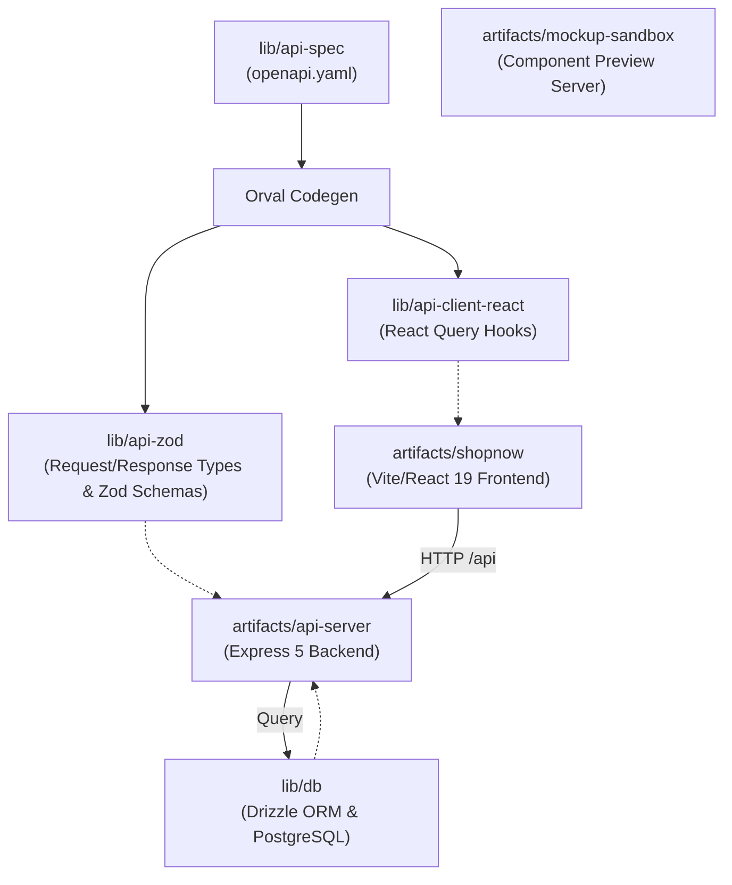
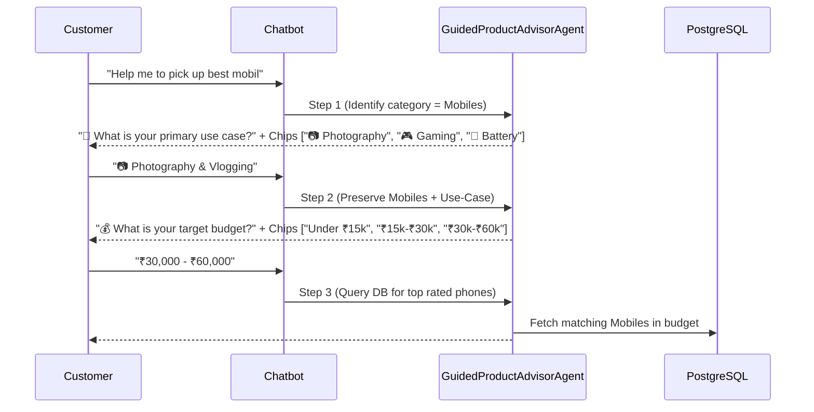

# ECommerce Design Suite: Architecture Analysis

This document provides a detailed breakdown of the project architecture, directory structure, data flow, database schemas, API routes, and runtime operations of the ECommerce Design Suite.

---

## 1. High-Level Architecture Overview

The codebase is organized as a **TypeScript-based monorepo** managed with **pnpm workspaces**. It is divided into two primary directories:

- **`lib/`**: Shared core logic, OpenAPI specifications, auto-generated API clients and Zod schemas, database connection pooling, and Drizzle ORM schemas.
- **`artifacts/`**: Deployable services and applications including the Express 5 API server, the main frontend client (ShopNow), and a dedicated visual design mockup sandbox.

The project relies on **Contract-First API Development** and **Automated Code Generation** to maintain 100% type safety and payload contract consistency between backend services and frontend applications.



---

## 2. Directory Structure & Repository Map

Here is where the key components of the application reside:

### Shared Libraries (`lib/`)

- **[`lib/api-spec`](file:///c:/My%20Projects/ECommerce-Design-Suite/ECommerce-Design-Suite/lib/api-spec)**: Contains the single source-of-truth OpenAPI specification ([`openapi.yaml`](file:///c:/My%20Projects/ECommerce-Design-Suite/ECommerce-Design-Suite/lib/api-spec/openapi.yaml)) and Orval configuration ([`orval.config.ts`](file:///c:/My%20Projects/ECommerce-Design-Suite/ECommerce-Design-Suite/lib/api-spec/orval.config.ts)).
- **[`lib/api-zod`](file:///c:/My%20Projects/ECommerce-Design-Suite/ECommerce-Design-Suite/lib/api-zod)**: Contains payload Zod schemas and TypeScript types generated by Orval. Used by the API server to validate incoming HTTP request payloads.
- **[`lib/api-client-react`](file:///c:/My%20Projects/ECommerce-Design-Suite/ECommerce-Design-Suite/lib/api-client-react)**: TanStack React Query hooks generated by Orval. Used by frontends for type-safe server queries and mutations.
- **[`lib/db`](file:///c:/My%20Projects/ECommerce-Design-Suite/ECommerce-Design-Suite/lib/db)**: The database layer. Configures PostgreSQL connection pooling ([`src/index.ts`](file:///c:/My%20Projects/ECommerce-Design-Suite/ECommerce-Design-Suite/lib/db/src/index.ts)) and defines Drizzle schemas ([`src/schema/`](file:///c:/My%20Projects/ECommerce-Design-Suite/ECommerce-Design-Suite/lib/db/src/schema/)).

### Applications & Services (`artifacts/`)

- **[`artifacts/api-server`](file:///c:/My%20Projects/ECommerce-Design-Suite/ECommerce-Design-Suite/artifacts/api-server)**: The backend web server built using Express 5.
  - **[`src/routes/`](file:///c:/My%20Projects/ECommerce-Design-Suite/ECommerce-Design-Suite/artifacts/api-server/src/routes/)**: Implements RESTful API endpoints for:
    - `auth.ts` — User registration, login, logout, profile session (`/api/auth/*`)
    - `products.ts` — Product list, deals, search, categories, product details (`/api/products/*`)
    - `cart.ts` — Shopping cart query, line-item mutations, and coupon apply/remove (`/api/cart/*`)
    - `checkout.ts` — Transactional checkout, final quote calculation, order snapshots, and coupon redemption (`/api/checkout`)
    - `coupons.ts` — Coupon validation and active campaign discovery (`/api/coupons/*`)
    - `gaming.ts` — Deterministic Gaming PC build recommendations (`/api/gaming/build`)
    - `orders.ts` — User order history (`GET /api/orders`) & single order details (`GET /api/orders/:id`)
    - `reviews.ts` — Product ratings & customer review submission (`/api/reviews/*`)
    - `recommendations.ts` — AI/Rule recommendation engines for Homepage, PDP, and Cart (`/api/recommendations/*`)
    - `ai.ts` — E-Commerce assistant AI chatbot endpoint (`/api/ai/chat`)
    - `agents/guided-product-advisor-agent.ts` — 3-Phase Multi-Turn Guided Consultation Engine for Mobiles, Laptops, Audio, Cameras, Accessories
    - `agents/gaming-build-advisor-agent.ts` — Guided multi-turn Gaming PC build brief collection, brand chooser & inline coupon calculator
    - `agents/supervisor-agent.ts` — Supervisor agent with fault-tolerant self-healing fallback and empathetic self-correction
    - `services/pricing.ts` — The single server-side authority for product and coupon quote calculations
    - `services/pc-builder.ts` — Deterministic component selection, budget allocation, and build-completeness gating
    - `health.ts` — Health check endpoint (`/api/healthz`)
- **[`artifacts/shopnow`](file:///c:/My%20Projects/ECommerce-Design-Suite/ECommerce-Design-Suite/artifacts/shopnow)**: "ShopNow Electronics" — the main consumer-facing web application built on Vite, React 19, Tailwind CSS (v4), Radix UI primitives, Lucide icons, and Framer Motion.
  - Features: Home, Search, Category views, Gaming component browsing, PDP with gallery & customer reviews, Cart/Checkout coupon entry and savings display, Order History (`OrderHistoryPage.tsx`), Dedicated Order Invoice Page (`OrderDetailPage.tsx` at `/order/:id`), Auth Pages (Login/Signup), recommendation carousels, and an AI Chatbot widget (`AIChatbot.tsx`).
- **[`artifacts/mockup-sandbox`](file:///c:/My%20Projects/ECommerce-Design-Suite/ECommerce-Design-Suite/artifacts/mockup-sandbox)**: An interactive development canvas environment allowing visual designers to preview UI components in isolation.
  - **[`mockupPreviewPlugin.ts`](file:///c:/My%20Projects/ECommerce-Design-Suite/ECommerce-Design-Suite/artifacts/mockup-sandbox/mockupPreviewPlugin.ts)**: Custom Vite plugin scanning `src/components/mockups/` on-the-fly and generating dynamic import manifests.

---

## 3. The Codegen Pipeline

The contract synchronization workflow prevents API drift:

```
[openapi.yaml] --(orval)---> [@workspace/api-zod] ---------> (Express Payload Validators)
                      |
                      +------> [@workspace/api-client-react] --> (React Query Client Hooks)
```

1. **Contract Definition**: Endpoints, query parameters, request schemas, and response schemas are specified in [`openapi.yaml`](file:///c:/My%20Projects/ECommerce-Design-Suite/ECommerce-Design-Suite/lib/api-spec/openapi.yaml).
2. **Code Generation**: Running `pnpm --filter @workspace/api-spec run codegen` invokes Orval to produce:
    - Zod validation rules inside `lib/api-zod`.
    - React Query hooks inside `lib/api-client-react` with custom fetch logic (`custom-fetch.ts`).
3. **Contract Synchronization**:
    - **Backend**: Server endpoints validate request bodies using generated Zod schemas (e.g. `AddToCartBody.safeParse(req.body)`).
    - **Frontend**: React components call type-safe query/mutation hooks (e.g. `useGetProducts`, `useAddToCart`, `useLogin`).

---

## 4. Database Schema Design

Data persistence is managed via **Drizzle ORM** with PostgreSQL. Schemas reside in [`lib/db/src/schema/`](file:///c:/My%20Projects/ECommerce-Design-Suite/ECommerce-Design-Suite/lib/db/src/schema/):

### 1. Users Table (`users`)

Stores user accounts and authentication details.

- `id`: Primary key (serial)
- `name`: Display name (text)
- `email`: Unique email address (text)
- `passwordHash`, `salt`: Salted password hash strings (text)
- `createdAt`: Registration timestamp

### 2. Products Table (`products`)

Stores the catalog of products with pricing, stock, and promotional flags.

- `id`: Primary key (serial)
- `name`, `brand`: Product name and manufacturer
- `price`, `originalPrice`: Decimal pricing values
- `discountPct`: Percentage discount calculation
- `category`: Existing flat category tag, retained for backwards compatibility
- `department`, `componentType`: Optional hierarchical catalog fields. Gaming products use `department = Gaming` and a component type such as `Processor`, `CPU Cooler`, `Graphics Card`, `RAM`, `Storage`, or `Power Supply`.
- `externalId`, `sourceUrl`: Optional supplier identity and product-page URL, used by idempotent catalog imports
- `imageUrl`, `images`: Primary asset link plus optional serialized gallery URL list
- `rating`, `reviewCount`: Cached aggregate rating metrics
- `inStock`, `stockCount`: Inventory counters
- `specs`: Serialized JSON product specifications.
- `isFeatured`, `isDeal`: Operational flags for homepage promotions

### 3. Cart Items Table (`cart_items`)

Stores session-based shopping cart items.

- `id`: Primary key (serial)
- `sessionId`: Session/User identifier mapping
- `productId`: Foreign key to `products.id`
- `quantity`: Line item quantity
- `createdAt`: Timestamp

### 4. Orders & Order Items (`orders`, `order_items`)

Stores customer orders and historical line items.

- `orders`: `id`, `userId` (FK to `users.id`), immutable `subtotalAmount`, `productDiscountAmount`, `couponDiscountAmount`, `shippingAmount`, final `totalAmount`, `appliedCouponCode`, `couponSnapshot` (JSONB), `status`, `shippingAddress` (JSONB), `paymentDetails` (JSONB), `createdAt`
- `order_items`: `id`, `orderId` (FK to `orders.id`), `productId` (FK to `products.id`), `quantity`, `priceAtPurchase`

### 5. Coupon Tables (`coupons`, `coupon_rules`, `coupon_redemptions`)

The promotion model is normalized so a campaign can target a department, component type, category, or individual product without changing the schema.

- `coupons`: Campaign lifecycle, uppercase coupon code, `percent`/`fixed` discount definition, optional discount cap, minimum eligible subtotal, global/per-user redemption limits, auto-apply flag, priority, and timestamps.
- `coupon_rules`: Include/exclude rules with `scopeType` of `department`, `componentType`, `category`, or `product`.
- `coupon_redemptions`: Immutable coupon/order/user audit record with discount and eligible-subtotal snapshots.

---

## 5. Multi-Turn Guided Electronics Advisor & PC Builder

### Guided Product Advisor Flow (`guided-product-advisor-agent.ts`)

For queries like *"Help me to pick up best mobil"*, *"help me choose a phone"*, *"recommend a laptop"*, *"which headphones should I buy?"*, or out-of-catalog categories like *"Help me pick a good TV"* or *"I want a tablet"*:



### Full 8-Component Human Store Advisor PC Builder (`gaming-build-advisor-agent.ts` & `pc-builder.ts`)

The PC Builder acts as a human store advisor, taking users through a 5-step consultation flow:

1. 💰 **Budget**: ₹60,000, ₹1,00,000, 1.5 lakh, ₹2,50,000, ₹3,00,000.
2. 🎯 **Use Case**: Pure Gaming & Esports, Content Creation, Streaming, Heavy Workstation.
3. 🔵🔴 **CPU Brand**: Intel, AMD Ryzen, or "Let AI decide".
4. 🟢🔴 **GPU Brand**: Nvidia RTX, AMD Radeon, or "Let AI decide".
5. 📺 **Monitor Resolution**: 1080p Esports, 1440p QHD, 4K Ultra, Multi-Monitor.

Once complete, it builds a complete 8-component rig:

1. ⚡ **Processor** (AMD Ryzen / Intel Core)
2. 🔌 **Motherboard** (ASUS, MSI, Gigabyte, ASRock) — *404 items in stock*
3. 🎮 **Graphics Card** (NVIDIA RTX / AMD Radeon)
4. 🧠 **RAM** (Corsair, G.Skill, Adata, Kingston)
5. 💾 **Storage** (Adata, Samsung, Crucial, WD)
6. ❄️ **CPU Cooler** (Liquid AIO & Air Coolers)
7. 📦 **Case / Cabinet** (Lian Li, Fractal Design, Ant Esports, NZXT) — *629 items in stock*
8. ⚡ **Power Supply** (80+ Gold/Bronze SMPS)

---

## 6. Order Details & Tax Invoice System (`/order/:id`, `/orders/:id`)

The dedicated Order Details page ([`OrderDetailPage.tsx`](file:///c:/My%20Projects/ECommerce-Design-Suite/ECommerce-Design-Suite/artifacts/shopnow/src/pages/OrderDetailPage.tsx)) provides:

1. **Line-Item Product Snapshots**: High-resolution thumbnails, brand/category tags, line prices, unit price at purchase, and **1-tap "Buy Again" / Reorder button**.
2. **Live Shipment Tracker**: 4-stage stepper tracking (`Order Placed` ➔ `Confirmed` ➔ `Shipped` ➔ `Delivered`).
3. **Authoritative Financial Breakdown**: Displays Subtotal, Product Markdowns, **Applied Coupon Code Badge & Savings Snapshot**, Free Shipping, and Total Paid.
4. **Printable Tax Invoice Modal**: 1-click **"Download Tax Invoice"** button generating a clean printable receipt (`#INV-5`) with full billing & address details.

---

## 7. How to Run and Build the Workspace

Always use **`pnpm`** as the monorepo package manager.

### Common Commands

| Command                                                                                  | Location | Description                                                       |
| :--------------------------------------------------------------------------------------- | :------- | :---------------------------------------------------------------- |
| `pnpm install`                                                                           | Root     | Installs dependencies across all workspace packages               |
| `pnpm run build`                                                                         | Root     | Compiles and builds all packages (including TypeScript checks)    |
| `pnpm run typecheck`                                                                     | Root     | Executes TypeScript type checking across entire monorepo          |
| `pnpm --filter @workspace/api-spec run codegen`                                          | Root     | Regenerates React Query hooks and Zod schemas from `openapi.yaml` |
| `pnpm --filter @workspace/db run push`                                                   | Root     | Pushes Drizzle DB schema updates to PostgreSQL                    |
| `pnpm --filter @workspace/db exec tsx --env-file=../../.env src/import-pc-components.ts` | Root     | Imports or updates the supplied Gaming catalog by `externalId`    |
| `pnpm --filter @workspace/api-server run dev`                                            | Root     | Launches backend Express API server on Port 5000                  |
| `pnpm --filter @workspace/shopnow run dev`                                               | Root     | Launches ShopNow frontend Vite dev server                         |
| `pnpm --filter @workspace/mockup-sandbox run dev`                                        | Root     | Launches mockup preview sandbox Vite dev server                   |

---

## 8. Key Tech Stack Summary

- **Package Manager**: `pnpm` workspaces
- **Language**: TypeScript `5.9`, Node.js `24`
- **Backend**: Express `5`, Pino Logger
- **Database & ORM**: PostgreSQL, Drizzle ORM, `drizzle-zod`
- **Input Validation**: Zod (`v4`)
- **Code Generation**: Orval (OpenAPI to React-Query + Zod)
- **Frontend Apps**: React `19`, Vite, TanStack React Query `v5`, Wouter routing, Tailwind CSS `v4`, Radix UI, Lucide React, Framer Motion
