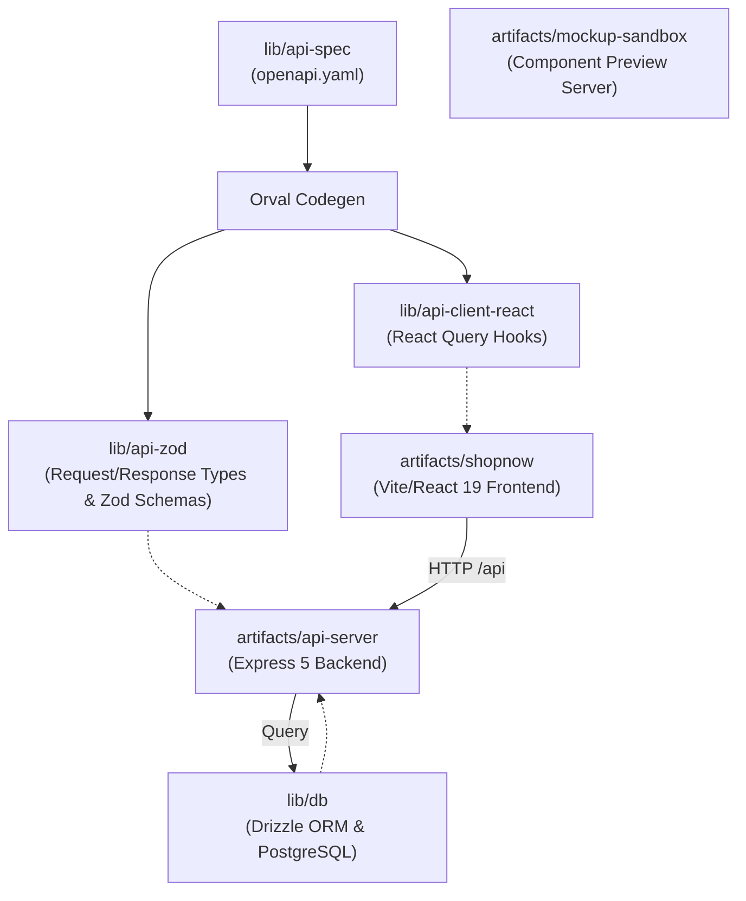
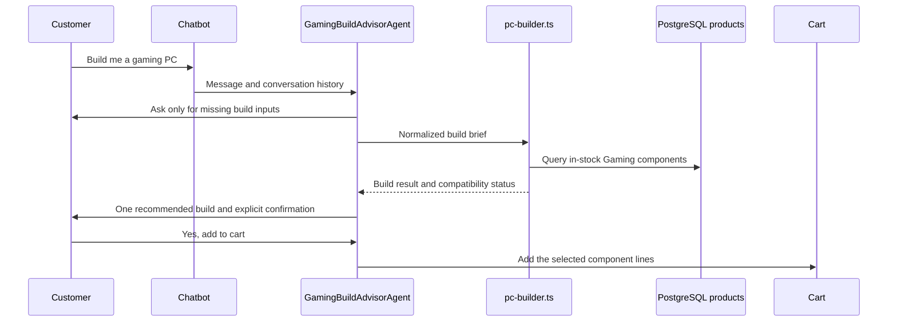
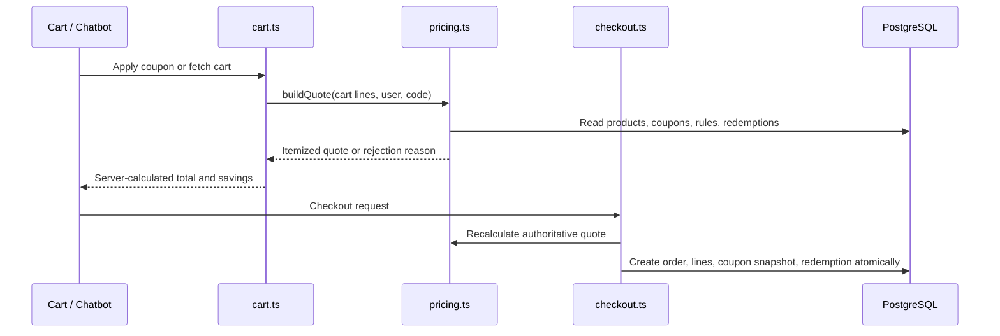

# ECommerce Design Suite: Architecture Analysis

This document provides a detailed breakdown of the project architecture, directory structure, data flow, database schemas, API routes, and runtime operations of the ECommerce Design Suite.

---

## 1. High-Level Architecture Overview

The codebase is organized as a **TypeScript-based monorepo** managed with **pnpm workspaces**. It is divided into two primary directories:

- **`lib/`**: Shared core logic, OpenAPI specifications, auto-generated API clients and Zod schemas, database connection pooling, and Drizzle ORM schemas.
- **`artifacts/`**: Deployable services and applications including the Express 5 API server, the main frontend client (ShopNow), and a dedicated visual design mockup sandbox.

The project relies on **Contract-First API Development** and **Automated Code Generation** to maintain 100% type safety and payload contract consistency between backend services and frontend applications.



---

## 2. Directory Structure & Repository Map

Here is where the key components of the application reside:

### Shared Libraries (`lib/`)

- **[`lib/api-spec`](file:///c:/My%20Projects/ECommerce-Design-Suite/ECommerce-Design-Suite/lib/api-spec)**: Contains the single source-of-truth OpenAPI specification ([`openapi.yaml`](file:///c:/My%20Projects/ECommerce-Design-Suite/ECommerce-Design-Suite/lib/api-spec/openapi.yaml)) and Orval configuration ([`orval.config.ts`](file:///c:/My%20Projects/ECommerce-Design-Suite/ECommerce-Design-Suite/lib/api-spec/orval.config.ts)).
- **[`lib/api-zod`](file:///c:/My%20Projects/ECommerce-Design-Suite/ECommerce-Design-Suite/lib/api-zod)**: Contains payload Zod schemas and TypeScript types generated by Orval. Used by the API server to validate incoming HTTP request payloads.
- **[`lib/api-client-react`](file:///c:/My%20Projects/ECommerce-Design-Suite/ECommerce-Design-Suite/lib/api-client-react)**: TanStack React Query hooks generated by Orval. Used by frontends for type-safe server queries and mutations.
- **[`lib/db`](file:///c:/My%20Projects/ECommerce-Design-Suite/ECommerce-Design-Suite/lib/db)**: The database layer. Configures PostgreSQL connection pooling ([`src/index.ts`](file:///c:/My%20Projects/ECommerce-Design-Suite/ECommerce-Design-Suite/lib/db/src/index.ts)) and defines Drizzle schemas ([`src/schema/`](file:///c:/My%20Projects/ECommerce-Design-Suite/ECommerce-Design-Suite/lib/db/src/schema/)).

### Applications & Services (`artifacts/`)

- **[`artifacts/api-server`](file:///c:/My%20Projects/ECommerce-Design-Suite/ECommerce-Design-Suite/artifacts/api-server)**: The backend web server built using Express 5.
  - **[`src/routes/`](file:///c:/My%20Projects/ECommerce-Design-Suite/ECommerce-Design-Suite/artifacts/api-server/src/routes/)**: Implements RESTful API endpoints for:
    - `auth.ts` — User registration, login, logout, profile session (`/api/auth/*`)
    - `products.ts` — Product list, deals, search, categories, product details (`/api/products/*`)
    - `cart.ts` — Shopping cart query, line-item mutations, and coupon apply/remove (`/api/cart/*`)
    - `checkout.ts` — Transactional checkout, final quote calculation, order snapshots, and coupon redemption (`/api/checkout`)
    - `coupons.ts` — Coupon validation and active campaign discovery (`/api/coupons/*`)
    - `gaming.ts` — Deterministic Gaming PC build recommendations (`/api/gaming/build`)
    - `orders.ts` — User order history & order details (`/api/orders/*`)
    - `reviews.ts` — Product ratings & customer review submission (`/api/reviews/*`)
    - `recommendations.ts` — AI/Rule recommendation engines for Homepage, PDP, and Cart (`/api/recommendations/*`)
    - `ai.ts` — E-Commerce assistant AI chatbot endpoint (`/api/ai/chat`)
    - `agents/gaming-build-advisor-agent.ts` — Guided multi-turn Gaming PC build brief collection and explicit add-to-cart confirmation
    - `services/pricing.ts` — The single server-side authority for product and coupon quote calculations
    - `services/pc-builder.ts` — Deterministic component selection, budget allocation, and build-completeness gating
    - `health.ts` — Health check endpoint (`/api/healthz`)
- **[`artifacts/shopnow`](file:///c:/My%20Projects/ECommerce-Design-Suite/ECommerce-Design-Suite/artifacts/shopnow)**: "ShopNow Electronics" — the main consumer-facing web application built on Vite, React 19, Tailwind CSS (v4), Radix UI primitives, Lucide icons, and Framer Motion.
  - Features: Home, Search, Category views, Gaming component browsing, PDP with gallery & customer reviews, Cart/Checkout coupon entry and savings display, Order History, Auth Pages (Login/Signup), recommendation carousels, and an AI Chatbot widget (`AIChatbot.tsx`).
- **[`artifacts/mockup-sandbox`](file:///c:/My%20Projects/ECommerce-Design-Suite/ECommerce-Design-Suite/artifacts/mockup-sandbox)**: An interactive development canvas environment allowing visual designers to preview UI components in isolation.
  - **[`mockupPreviewPlugin.ts`](file:///c:/My%20Projects/ECommerce-Design-Suite/ECommerce-Design-Suite/artifacts/mockup-sandbox/mockupPreviewPlugin.ts)**: Custom Vite plugin scanning `src/components/mockups/` on-the-fly and generating dynamic import manifests.

---

## 3. The Codegen Pipeline

The contract synchronization workflow prevents API drift:

```
[openapi.yaml] --(orval)---> [@workspace/api-zod] ---------> (Express Payload Validators)
                      |
                      +------> [@workspace/api-client-react] --> (React Query Client Hooks)
```

1.  **Contract Definition**: Endpoints, query parameters, request schemas, and response schemas are specified in [`openapi.yaml`](file:///c:/My%20Projects/ECommerce-Design-Suite/ECommerce-Design-Suite/lib/api-spec/openapi.yaml).
2.  **Code Generation**: Running `pnpm --filter @workspace/api-spec run codegen` invokes Orval to produce:
    - Zod validation rules inside `lib/api-zod`.
    - React Query hooks inside `lib/api-client-react` with custom fetch logic (`custom-fetch.ts`).
3.  **Contract Synchronization**:
    - **Backend**: Server endpoints validate request bodies using generated Zod schemas (e.g. `AddToCartBody.safeParse(req.body)`).
    - **Frontend**: React components call type-safe query/mutation hooks (e.g. `useGetProducts`, `useAddToCart`, `useLogin`).
    - **Rule**: API changes begin in `openapi.yaml`; regenerate both generated libraries before consuming newly added route fields or hooks.

---

## 4. Database Schema Design

Data persistence is managed via **Drizzle ORM** with PostgreSQL. Schemas reside in [`lib/db/src/schema/`](file:///c:/My%20Projects/ECommerce-Design-Suite/ECommerce-Design-Suite/lib/db/src/schema/):

### 1. Users Table (`users`)

Stores user accounts and authentication details.

- `id`: Primary key (serial)
- `name`: Display name (text)
- `email`: Unique email address (text)
- `passwordHash`, `salt`: Salted password hash strings (text)
- `createdAt`: Registration timestamp

### 2. Products Table (`products`)

Stores the catalog of products with pricing, stock, and promotional flags.

- `id`: Primary key (serial)
- `name`, `brand`: Product name and manufacturer
- `price`, `originalPrice`: Decimal pricing values
- `discountPct`: Percentage discount calculation
- `category`: Existing flat category tag, retained for backwards compatibility
- `department`, `componentType`: Optional hierarchical catalog fields. Gaming products use `department = Gaming` and a component type such as `Processor`, `CPU Cooler`, `Graphics Card`, `RAM`, `Storage`, or `Power Supply`.
- `externalId`, `sourceUrl`: Optional supplier identity and product-page URL, used by idempotent catalog imports
- `imageUrl`, `images`: Primary asset link plus optional serialized gallery URL list
- `rating`, `reviewCount`: Cached aggregate rating metrics
- `inStock`, `stockCount`: Inventory counters
- `specs`: Serialized JSON product specifications. Gaming imports retain supplier fields and normalize compatibility keys where available, including CPU socket, cooler sockets, RAM generation, GPU length, PSU wattage, radiator size, and storage interface.
- `isFeatured`, `isDeal`: Operational flags for homepage promotions

The catalog importer is [`lib/db/src/import-pc-components.ts`](file:///c:/My%20Projects/ECommerce-Design-Suite/ECommerce-Design-Suite/lib/db/src/import-pc-components.ts). It imports `pc_components_shopnow.json` through `externalId` upserts, maps its supplied component categories to the Gaming department, preserves INR price/stock data, and reports rejected source records.

### 3. Cart Items Table (`cart_items`)

Stores session-based shopping cart items.

- `id`: Primary key (serial)
- `sessionId`: Session/User identifier mapping
- `productId`: Foreign key to `products.id`
- `quantity`: Line item quantity
- `createdAt`: Timestamp

### 4. Orders & Order Items (`orders`, `order_items`)

Stores customer orders and historical line items.

- `orders`: `id`, `userId` (FK to `users.id`), immutable `subtotalAmount`, `productDiscountAmount`, `couponDiscountAmount`, `shippingAmount`, final `totalAmount`, `appliedCouponCode`, `couponSnapshot` (JSONB), `status`, `shippingAddress` (JSONB), `paymentDetails` (JSONB), `createdAt`
- `order_items`: `id`, `orderId` (FK to `orders.id`), `productId` (FK to `products.id`), `quantity`, `priceAtPurchase`

### 5. Coupon Tables (`coupons`, `coupon_rules`, `coupon_redemptions`)

The promotion model is normalized so a campaign can target a department, component type, category, or individual product without changing the schema.

- `coupons`: Campaign lifecycle, uppercase coupon code, `percent`/`fixed` discount definition, optional discount cap, minimum eligible subtotal, global/per-user redemption limits, auto-apply flag, priority, and timestamps.
- `coupon_rules`: Include/exclude rules with `scopeType` of `department`, `componentType`, `category`, or `product`. A coupon with no include rule is catalog-wide subject to its other limits.
- `coupon_redemptions`: Immutable coupon/order/user audit record with discount and eligible-subtotal snapshots. There is one redemption per order.

### 6. Product Reviews Table (`reviews`)

Stores verified customer reviews with rating constraints.

- `id`: Primary key (serial)
- `productId`: Foreign key to `products.id`
- `userId`: Foreign key to `users.id`
- `userName`: Author display name
- `rating`: Rating score (1-5 integer)
- `title`, `comment`: Review content
- `createdAt`: Timestamp
- Unique index on `(user_id, product_id)` ensures one review per user per product.

---

## 5. Gaming Catalog and PC Builder

Gaming is represented inside the existing `products` table rather than in a separate catalog. This retains current product, search, cart, and PDP behavior while adding hierarchical filtering for Gaming inventory.

### Catalog and Browse Flow

1. The importer maps supplier categories to `department = Gaming` and a normalized `componentType`.
2. `GET /api/products/search` accepts the existing filters plus `department` and `componentType`.
3. `CategoryPage` treats `/category/Gaming` as a department view and provides component filters for processors, coolers, GPUs, RAM, storage, and PSUs.
4. Existing category views continue to use the flat `category` field.

### Guided Build Flow

The chatbot uses `GamingBuildAdvisorAgent` for messages such as "build a gaming PC", "gaming rig", "PC build", or component-compatibility queries. It collects the smallest practical build brief over multiple turns:

- Budget in INR
- Workload: gaming, streaming, creator, or workstation
- Target display: 1080p60, 1080p144, 1440p144, or 4k60
- Optional streaming, CPU/GPU brand, form-factor, and peripheral preferences

`pc-builder.ts` selects inventory deterministically using budget allocation, stock, component type, ratings, and available normalized specifications. It returns product IDs, rationale, estimated power draw, compatibility errors, and a budget remainder. The LLM may explain the result but must not override the compatibility service or price calculation.



### Completeness & Full 8-Component Rig Engine

The importer maps supplier categories from `pc_components_shopnow.json` into `department = Gaming` and a normalized `componentType`. The catalog now contains **404 Motherboards** and **629 Cases / Cabinets**, enabling **Full 8-Component Build Mode** (`isComplete: true`) across all gaming builds:

1. ⚡ **Processor** (AMD Ryzen / Intel Core)
2. 🔌 **Motherboard** (ASUS, MSI, Gigabyte, ASRock) — *404 items in stock*
3. 🎮 **Graphics Card** (NVIDIA RTX / AMD Radeon)
4. 🧠 **RAM** (Corsair, G.Skill, Adata, Kingston)
5. 💾 **Storage** (Adata, Samsung, Crucial, WD)
6. ❄️ **CPU Cooler** (Liquid AIO & Air Coolers)
7. 📦 **Case / Cabinet** (Lian Li, Fractal Design, Ant Esports, NZXT) — *629 items in stock*
8. ⚡ **Power Supply** (80+ Gold/Bronze SMPS)

### Adaptive Self-Correction & Brand Customization Chooser

- **`self-correction-engine.ts`**: Intercepts user corrections and feedback (e.g. *"no I meant AMD GPU"*, *"budget is 1.5 lakh"*, *"wrong brand"*), categorizes correction types, and returns polite, empathetic self-correcting response prefixes.
- **Stockpile Brand Chooser**: Dynamically queries in-stock brands across all 8 component stockpiles. When users request unstocked or future hardware (e.g. `"NVIDIA RTX 5090"`), the bot checks catalog inventory, lists available in-stock brands, and provides 1-tap brand discovery chips.

---

## 6. Pricing and Coupon Architecture

`services/pricing.ts` is the pricing authority. Cart display, checkout, and chatbot responses must call it rather than duplicating discount math in frontend code or LLM prompts.

### Quote Calculation

`buildQuote(lines, userId, couponCode?)`:

1. Enriches cart lines with authoritative product data.
2. Calculates subtotal and product-level markdown savings independently.
3. Resolves a manual coupon code or the best currently eligible auto-apply coupon.
4. Applies include/exclude rules, date windows, eligible subtotal minimums, caps, and global/per-user redemption limits.
5. Returns an itemized quote with either an applied coupon or a user-safe rejection reason.

Coupon stacking is currently disabled. A manually entered valid coupon takes precedence over auto-apply selection.

### Cart and Checkout Contract

- `GET /api/cart` returns the server quote, including `couponApplied`, `couponInfo`, coupon discount, final total, and product discount snapshot values.
- `POST /api/cart/coupon` selects a coupon for the current cart session; `DELETE /api/cart/coupon` clears it.
- `GET /api/coupons/validate` previews a code; `GET /api/coupons/active` exposes active campaign metadata and eligibility rules for assistant/UI discovery.
- `POST /api/checkout` re-reads cart lines and recalculates the quote server-side. It creates the order, order items, and coupon redemption record in one transaction, retaining the coupon snapshot with the order.

This design fixes the previous failure mode where cart displayed a hardcoded discount while checkout charged the pre-discount total.



---

## 5. Mockup Sandbox Architecture

The mockup sandbox is a developer preview utility:

- **Dynamic Directory Scanning**: [`mockupPreviewPlugin.ts`](file:///c:/My%20Projects/ECommerce-Design-Suite/ECommerce-Design-Suite/artifacts/mockup-sandbox/mockupPreviewPlugin.ts) watches `src/components/mockups/`.
- **Manifest Generation**: Generates `src/.generated/mockup-components.ts` mapping path slugs to dynamic imports.
- **Isolated Component Rendering**: Displays design mockups in clean isolation for rapid UI design iterations.

---

## 6. How to Run and Build the Workspace

Always use **`pnpm`** as the monorepo package manager.

### Common Commands

| Command                                                                                  | Location | Description                                                       |
| :--------------------------------------------------------------------------------------- | :------- | :---------------------------------------------------------------- |
| `pnpm install`                                                                           | Root     | Installs dependencies across all workspace packages               |
| `pnpm run build`                                                                         | Root     | Compiles and builds all packages (including TypeScript checks)    |
| `pnpm run typecheck`                                                                     | Root     | Executes TypeScript type checking across entire monorepo          |
| `pnpm --filter @workspace/api-spec run codegen`                                          | Root     | Regenerates React Query hooks and Zod schemas from `openapi.yaml` |
| `pnpm --filter @workspace/db run push`                                                   | Root     | Pushes Drizzle DB schema updates to PostgreSQL                    |
| `pnpm --filter @workspace/db exec tsx --env-file=../../.env src/import-pc-components.ts` | Root     | Imports or updates the supplied Gaming catalog by `externalId`    |
| `pnpm --filter @workspace/api-server run dev`                                            | Root     | Launches backend Express API server on Port 5000                  |
| `pnpm --filter @workspace/shopnow run dev`                                               | Root     | Launches ShopNow frontend Vite dev server                         |
| `pnpm --filter @workspace/mockup-sandbox run dev`                                        | Root     | Launches mockup preview sandbox Vite dev server                   |

---

## 7. Key Tech Stack Summary

- **Package Manager**: `pnpm` workspaces
- **Language**: TypeScript `5.9`, Node.js `24`
- **Backend**: Express `5`, Pino Logger
- **Database & ORM**: PostgreSQL, Drizzle ORM, `drizzle-zod`
- **Input Validation**: Zod (`v4`)
- **Code Generation**: Orval (OpenAPI to React-Query + Zod)
- **Frontend Apps**: React `19`, Vite, TanStack React Query `v5`, Wouter routing, Tailwind CSS `v4`, Radix UI, Lucide React, Framer Motion

---

## 8. Gaming and Coupon Release Checklist

Before enabling Gaming PC builds and promotions in a deployed environment:

1. Run `pnpm --filter @workspace/db run push` against the target PostgreSQL database.
2. Run the Gaming catalog import (`import-pc-components.ts`) and verify that all 3,000+ gaming products (including 404 Motherboards and 629 Cases) are inserted/updated with active stock (`inStock: true`, `stockCount: 50`).
3. Seed coupon campaigns (`seed-coupons.ts`) and verify active campaigns (`BUILD50K`, `GAMING10`, `CPU15`, `GPU5K`).
4. Regenerate the OpenAPI Zod and React client packages after API-contract changes, then run `pnpm run typecheck`.
5. Test cart and checkout totals with an eligible coupon, an ineligible coupon, and an expired or exhausted coupon. The displayed quote and stored order total must match.
6. Verify full 8-component PC builds in the AI Chatbot widget (`/api/ai/chat`) to ensure all 8 core hardware components are recommended and brand chooser chips function as expected.
